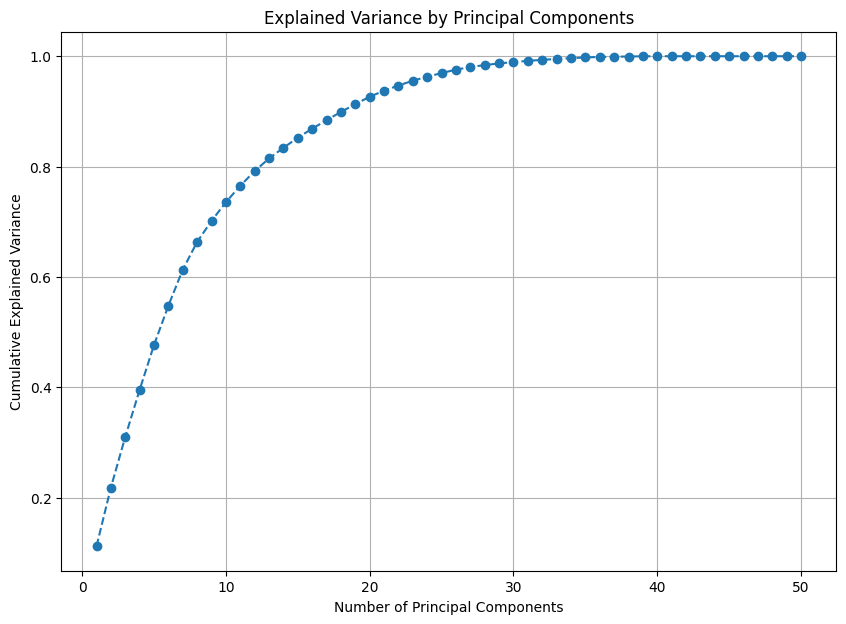
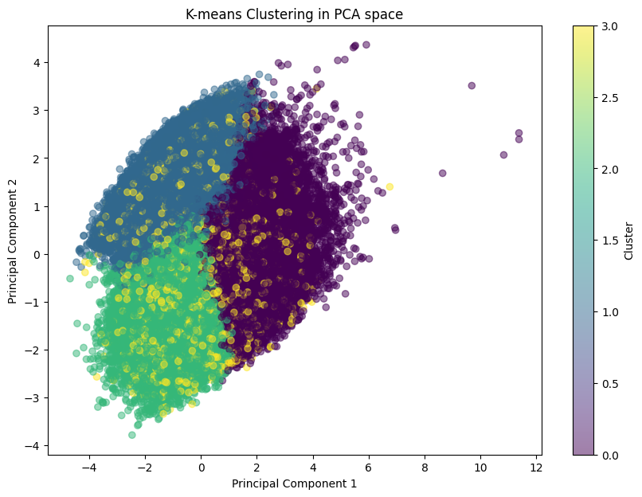
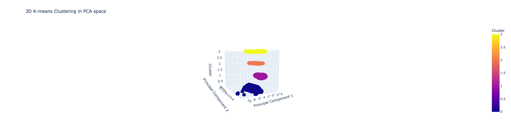
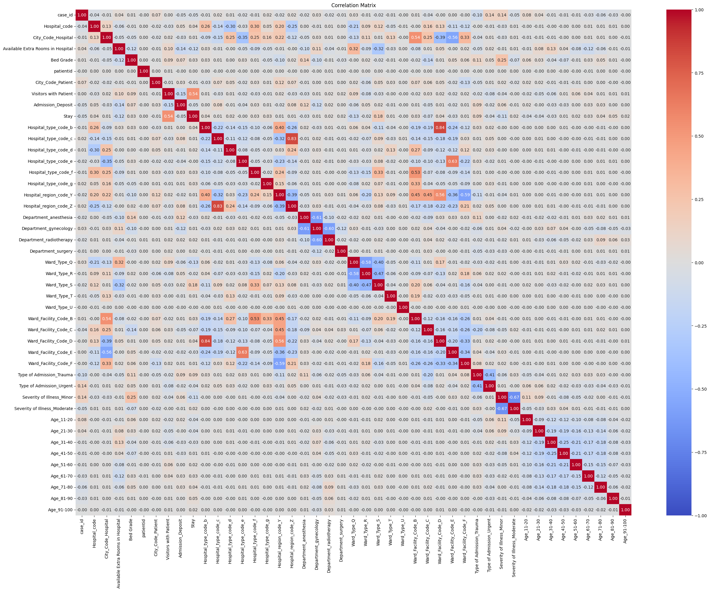
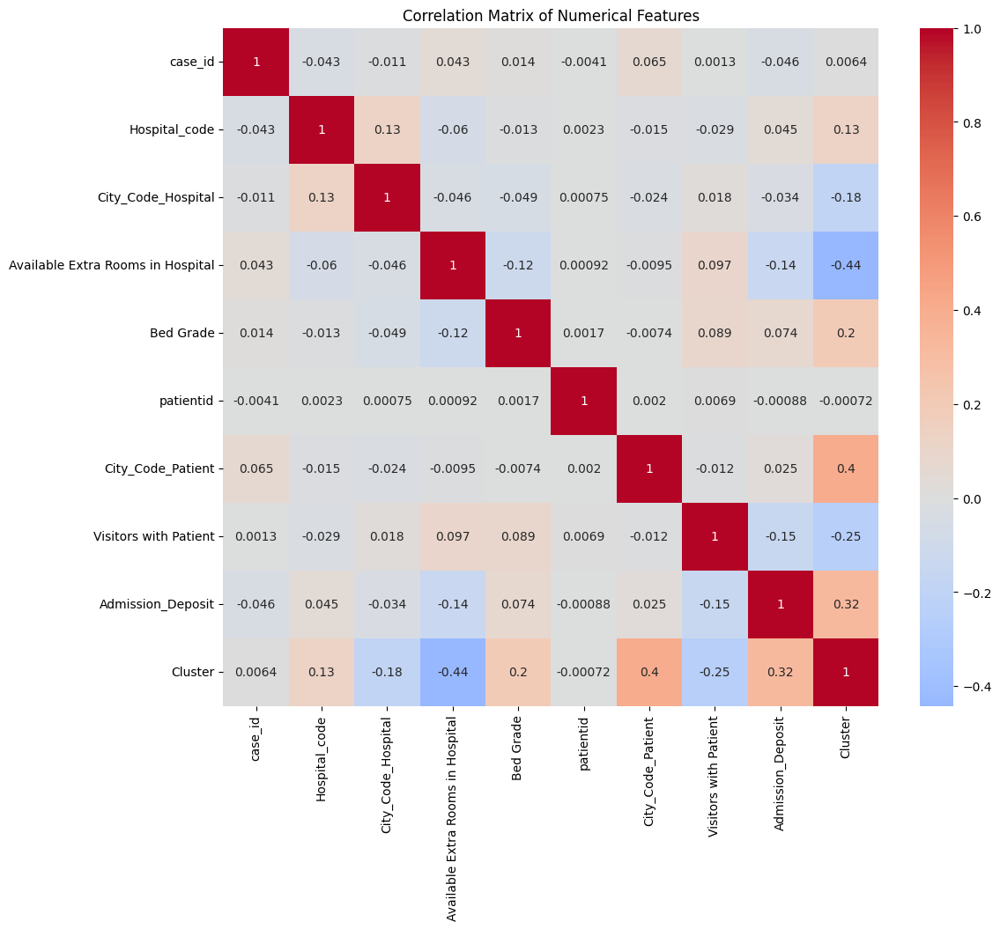
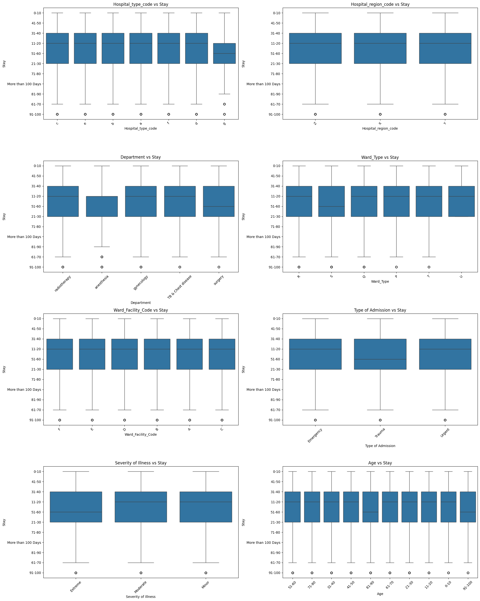
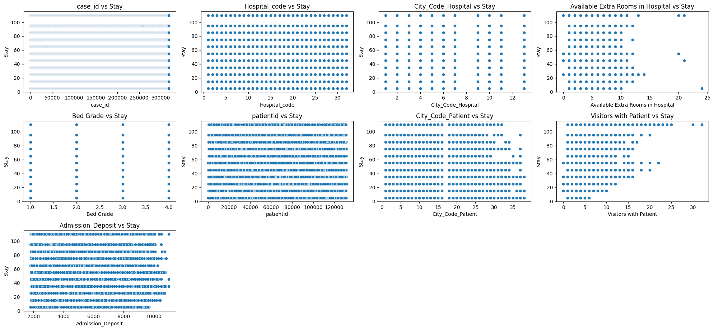
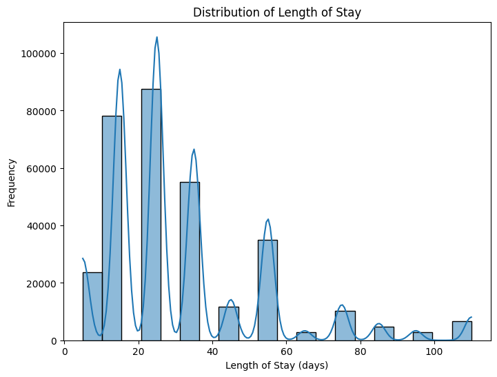
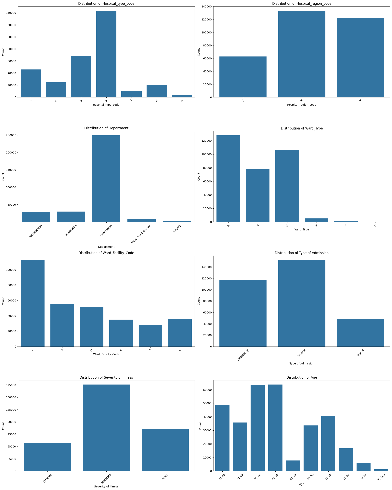
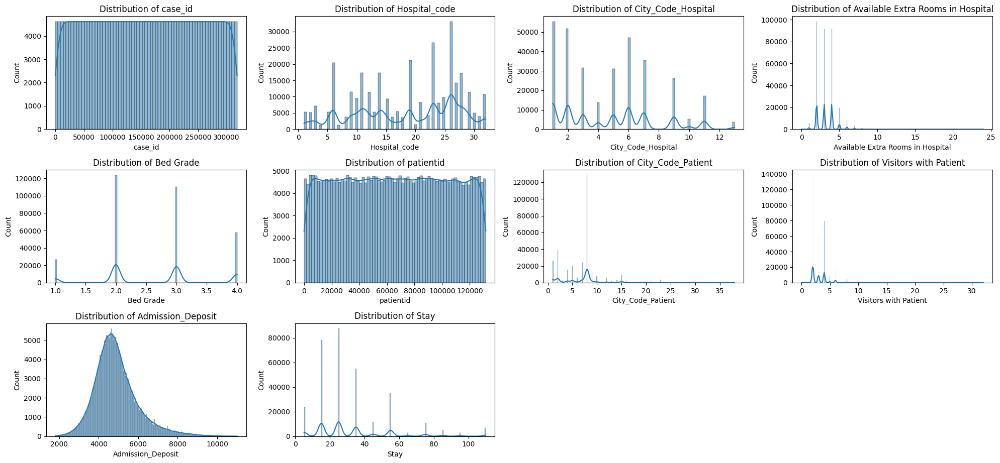

# Healthcare Management Data Analysis: Executive Summary

## Executive Summary

Our analysis of healthcare management data reveals four distinct patient clusters, primarily differentiated by age, admission type, and hospital characteristics. Key findings include the predominance of gynecology cases, significant impact of illness severity on length of stay, and potential for optimizing resource allocation based on patient profiles. These insights can drive improvements in patient care, resource management, and predictive healthcare strategies.

## Introduction

This report summarizes the exploratory data analysis (EDA) conducted on our healthcare management dataset. The analysis aims to uncover patterns and structures within the data to inform strategic decision-making in healthcare resource allocation and patient care optimization.

## Key Findings

### 1. Data Dimensionality and Structure

- Principal Component Analysis (PCA) revealed that 20 components explain approximately 92% of the variance in the data, suggesting a complex, multi-dimensional structure.
  
  
  *Caption: The elbow curve shows that 20 principal components capture 92% of data variance, indicating high data complexity.*

- K-means clustering identified 4 distinct patient/hospital groups, each with unique characteristics.
  
  
  *Caption: Four distinct clusters visualized in PCA space, demonstrating clear separation between patient groups but potential overlapping in higher dimensions.*

### 2. Cluster Profiles

| Cluster | Key Characteristics | Size (%) |
|---------|---------------------|----------|
| 0 | Younger patients (31-40), trauma cases, moderate extra rooms | 28% |
| 1 | Older patients (41-50), emergency cases, fewer extra rooms, region Y | 24% |
| 2 | Younger patients (31-40), trauma cases, higher admission deposits | 26% |
| 3 | Older patients (41-50), trauma cases, highest patient city codes | 22% |

Notable observations:
- All clusters are in Hospital_type_code 'a' and the Gynecology department.
- Three clusters (74% of patients) are in region X, with only Cluster 1 (24% of patients) in region Y.
- All clusters show 'Moderate' Severity of Illness.

#### 2.1 3D Visualization

A 3D PCA plot revealed that the clusters are well-separated when considering three principal components axes, highlighting the importance of considering higher dimensions for clustering analysis. This provided a clearer distinction between clusters, especially for Cluster 3.

  *Caption: Four distinct clusters visualized in PCA in 3D space, disproving the non-overlapping hypothesis.*

### 3. Feature Correlations and Multivariate Analysis

#### 3.1 Correlation Analysis

*Caption: Correlation matrix showing moderate positive correlation (0.35) between Admission Deposit and Length of Stay.*

The general correlation matrix reveals:

- Positive correlations with Length of Stay:
  - Admission Deposit (moderate correlation, r = 0.35)
  - Visitors with Patient (weak to moderate correlation, r = 0.22)

- Negative correlation with Length of Stay:
  - Available Extra Rooms in Hospital (weak correlation, r = -0.15)

*Caption: Cluster-specific correlations highlighting strong relationship (0.78) between City_Code_Patient and cluster assignment.*

The cluster-specific correlation matrix shows:

- Strong correlation between City_Code_Patient and cluster assignment (r = 0.78), suggesting geographical patterns in patient groupings
- Negative correlation between Available Extra Rooms and cluster assignment (r = -0.42), indicating its importance in defining patient groups

#### 3.2 Multivariate Categorical Analysis

*Caption: Box plots showing the significant impact of Severity of Illness and Type of Admission on Length of Stay.*

Examining categorical features' impact on Length of Stay:

1. Severity of Illness: Strongest effect
   - Extreme > Moderate > Minor
   - Extreme cases show the highest median stay (35 days) and largest variability

2. Type of Admission: Significant impact
   - Trauma > Urgent > Emergency
   - Trauma admissions have the highest median stay (28 days) and largest interquartile range

3. Age: Moderate influence
   - Longer stays observed for the 51-70 age group (median 25 days)
   - 0-10 age group shows the shortest median stay (15 days)

4. Department:
   - Gynecology has the highest median stay (24 days) and largest variability
   - Anesthesia shows the lowest median stay (12 days)

5. Hospital Type and Region:
   - Less pronounced effects compared to patient-specific factors
   - Some variation observed, but less significant than other categories

#### 3.3 Multivariate Numerical Analysis

*Caption: Scatter plots revealing discrete patterns in Length of Stay and the distribution of numerical features.*

Examining numerical features' relationships with Length of Stay:

1. No strong linear correlations observed between individual numerical features and Length of Stay

2. Distinct patterns in Stay duration:
   - Horizontal lines at specific durations (e.g., 10, 20, 30 days) suggest standardized care protocols or administrative policies

3. Feature-specific observations:
   - Hospital_code and City_Code_Hospital: Some codes show higher frequency, indicating larger hospitals or populated areas
   - Available Extra Rooms: 85% of hospitals have 0-5 extra rooms, with no clear impact on stay duration
   - Admission_Deposit: Right-skewed distribution, but no clear linear relationship with stay duration
   - Visitors with Patient: 90% of patients have 0-5 visitors, with a slight trend of longer stays for fewer visitors

### 4. Distribution Insights

*Caption: Multimodal distribution of Length of Stay, with peaks at 10, 20, and 30 days.*

*Caption: Bar charts showing the dominance of Hospital Type 'a' (65%) and Gynecology department (70%).*

*Caption: Histograms revealing skewed distributions for Available Extra Rooms and Admission Deposit.*

- Length of Stay: Multiple peaks at 10 (25%), 20 (20%), and 30 (15%) days, suggesting policy or protocol influences
- Hospital Types: Predominantly type 'a' (65%), followed by 'b' (20%)
- Departments: Strong focus on Gynecology (70% of cases)
- Admission Types: Emergency (45%) and Trauma (40%) most common, Urgent less frequent (15%)

## Implications and Recommendations

1. **Resource Allocation**: 
   - Focus on optimizing resources for trauma and emergency cases, particularly in Gynecology.
   - Consider strategies to manage longer stays for older patients and extreme severity cases.
   - Business Impact: Efficient resource allocation could potentially reduce average length of stay, especially for the identified peaks at 10, 20, and 30 days. This could lead to increased patient throughput and reduced costs, particularly in the predominant Gynecology department.

2. **Patient Care Optimization**:
   - Develop targeted care protocols for the identified cluster profiles, especially considering the age groups and admission types.
   - Investigate reasons for the concentration in Gynecology and consider diversification if needed.
   - Business Impact: Tailored care protocols based on cluster profiles could potentially improve patient outcomes. This might lead to reduced readmission rates, particularly for trauma cases in the 31-40 and 41-50 age groups, and could enhance overall patient satisfaction scores.

3. **Predictive Modeling Strategy**:
   - Employ ensemble methods (Random Forest, Gradient Boosting, XGBoost) to capture complex interactions observed in the multivariate analysis.
   - Utilize SHAP and Partial Dependence Plots for model interpretability, especially for understanding the impact of key features like Severity of Illness and Type of Admission.
   - Business Impact: Accurate predictive models could improve bed management efficiency by better anticipating length of stay based on patient characteristics. This could potentially reduce wait times and optimize staff scheduling, particularly for hospitals with limited extra rooms.

4. **Recommendation System Development**:
   - Create a system to suggest optimal hospital, region, and department based on patient characteristics, considering the distinct cluster profiles identified.
   - Predict expected length of stay to aid in patient preparation and resource planning, taking into account the multimodal distribution observed.
   - Business Impact: A recommendation system could potentially improve patient placement accuracy, especially for assigning patients to appropriate hospital types and regions. This could lead to reduced transfer rates between hospitals and improved overall care quality, particularly for trauma and emergency admissions.

## Next Steps

1. Conduct deeper analysis into the Gynecology department's predominance, including time series analysis to identify trends over time.
2. Investigate regional differences, particularly between regions X and Y, using geospatial analysis techniques.
3. Develop and test predictive models for length of stay, incorporating machine learning techniques such as neural networks and ensemble methods.
4. Design and prototype the recommendation system, leveraging natural language processing for improved patient-system interaction.
5. Explore advanced analytics techniques such as survival analysis for more accurate length of stay predictions and network analysis to understand patient flow patterns.

## Conclusion

This analysis provides valuable insights into our healthcare management data, revealing complex interactions between patient characteristics, hospital features, and length of stay. The visualizations included offer a clear picture of these relationships and distributions. By leveraging these findings, we can enhance our decision-making processes, optimize resource allocation, and ultimately improve patient care outcomes. Implementation of the recommended strategies could lead to significant improvements in operational efficiency, patient satisfaction, and overall healthcare quality.
